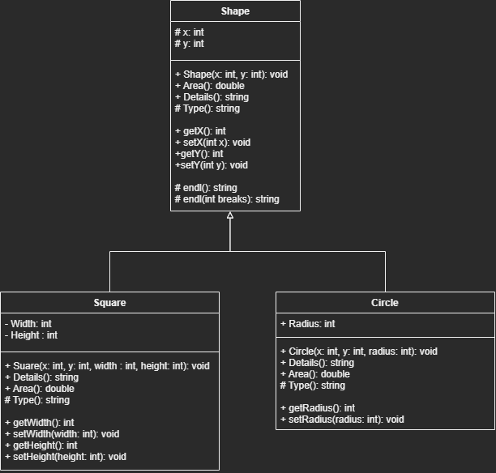

# Abstract Class Experiment

## Description

While learning Java, I wanted to experiment with a couple of things. mainly
- Abstract Classes
- Class inheritance
- Polymorphism

## UML


## Abstract Classes

Judging from the UML diagram above, I decided to make shape the abstract base class

### Shape Class
```java
public abstract class Shape {
    protected abstract String Type();

    public abstract double Area();
    public String Details(){
        
    }
    // Rest of the class
}
```

The reason why the Area & the Type methods are abstract is because there is no clear definition of how to implement these methods 
